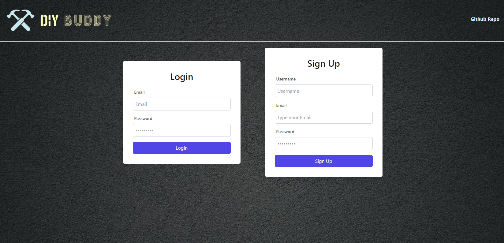

# DIY Buddy

## Table of Contents

- [Description](#description)
- [Built With](#built-with)
- [Getting Started](#getting-started)
- [Usage Instructions](#usage-instructions)
- [License Section](#license)
- [Tests](#tests)
- [Contact Us](#contact-us)

## Description

A DIY Project Planner that allows you to login and plan your DIY projects, along with keeping track of your budget estimation and materials needs. 

(<a href="#readme-top">back to top</a>)

## Built With

- HTML
- CSS
- Tailwind
- JavaScript
- Node.js
- Express.js
- Insomnia (for testing)
- Handlebars.js
- MySQL
- Sequelize
- dotenv (to create the environmental variables)
- Heroku (for deployment)
- Multer (for photo uploading)

(<a href="#readme-top">back to top</a>)

## Getting Started

### Node.js Installation

To check if you already have Node.js installed on your computer, enter node -v in the command line. If successful, the command prompt will return a version number. Otherwise, please install Node.js at https://nodejs.org/en/ and clicking on the LTS version. If you are on Windows, make sure to look for the section that says `Download for Windows (x64)`. If you are using macOS, make sure to look for the section that says `Download for MacOS (x64)`

### Clone the Repo

Once Node.js has been successfully installed, click on the green "<> Code" button and copy the link of the repo. Head over to your code editor and open the terminal. In the terminal, "cd" into the directory you want this repo to be cloned into. Once in the folder, type "git clone" and paste the link copied. The complete repo will be successfully cloned into your folder when entered.

### Express.js

You must also install the Express.js npm package to run the server. Since Express.js is an npm package instead of being built directly into node.js, you must type `npm init` into the command line to allow npm packages to be installed. Next, go to the server.js file, and in the command line, type `npm install express` to install Express.js on your computer. For documentation on Express.js follow this link https://expressjs.com/en/4x/api.html.

(<a href="#readme-top">back to top</a>)

## Usage Instructions

To use the deployed site, please head over to: https://diy-buddy-app-final-3c3eca16d427.herokuapp.com/

The page should open as per below screenshots:

1. Once on the site, click on Sign Up to create a new account. Otherwise, click on Login if you already have an account. 

2. After signing up for an account and logging into your account, you will be navigated to the homepage.

3. On the homepage, you can click on the "Create a new project" button which will take you to a pop-up page to enter all the details required to create a new project. 

4. Once all details have been entered and saved, you will see the project page with all the details you have just entered, and also a "Add tasks" button, which will take you to the next page to enter tasks. 

5. In this page, you will be able to enter each task one by one, and drag each task to each of the 4 sections (New, Urgent, In Progress and Completed) of the kanban board so that you will know the status of each task. 

6. At any given time, you will be able to logout of your account, and log back in as you wish. 

(<a href="#readme-top">back to top</a>)

## License

Permission to use this application is granted under the MIT license.
Click on the link for more information: [MIT License Information](https://opensource.org/licenses/MIT)

(<a href="#readme-top">back to top</a>)

## Tests

### Insomnia

Insomnia was used to seed and test the routes for this app. There is no command for running these tests. 
1. To test the application, download insomnia. For more information on Insomnia, follow this link: https://docs.insomnia.rest/.

2. Run `npm run seeds` in the command-line to get preseeded data. 

3. Run `npm run start` to start the server

4. Go to Insomnia and test for the route you want to test. Make sure to change the route from GET to POST Or DELETE depending on what you want to test for. 

(<a href="#readme-top">back to top</a>)

## Contact Us

https://github.com/Petarlo  
https://github.com/MuhammadKhabbaz  
https://github.com/Lankycodes1  
https://github.com/miloyang
